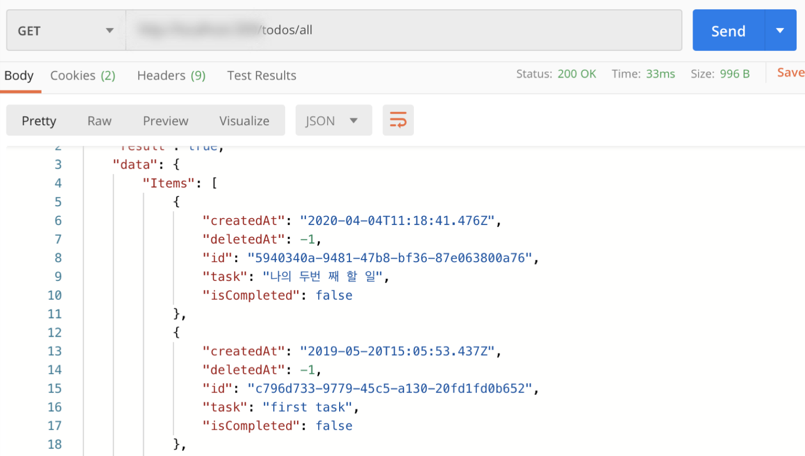

## Study-lambda-server

### 람다로 TodoList CRUD Api 서버 만들기  ###
- lambda
- dynamodb
- typescript
 

#### 실습 의의 ####

>lambda + Typescript로 간단한 API 서버를 만들고, AWS 배포 환경을 조성하였습니다.  
>서버리스의 기본 개념을 공부하였습니다.  
>비관계형 데이터베이스 (NOsql, Dynamodb)의 기본 개념을 공부하였습니다.   

참고 도서: http://www.yes24.com/Product/Goods/84793216